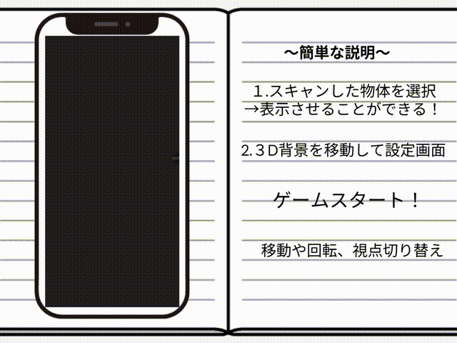

# UbiTsumi

[](#)


Unity 製「動物タワー風」3Dゲーム
研究室を舞台に、身の回りのモノを積み上げて遊べます

---

## 📽️ Demo
[](https://github.com/user-attachments/assets/ad2d3c38-0f14-4bed-9956-113ea5e775a8)

---

## Overview
- 研究室メンバー間の技術コンペ向けに開発
- 好きな物体を3Dスキャンオブジェクトとして読み込み、ゲーム内に登場
- モード：ScoreAttack / VS（今後拡張予定）


> [!Note]  
> 実際の物体スキャンには **Polycam** などの外部アプリを使用します


---

## 🚀 Quick Start
1. Unity Hub でプロジェクトを開く  
2. `Assets/Scenes/Home.unity` を開く  
3. ▶ を押して実行

---

## 🧰 Tech Stack
- **Engine:** Unity 6000.0.48f1  
- **Runtime:** URP / IL2CPP 対応  
- **Libraries:**  
  - [glTFast](https://github.com/atteneder/glTFast) – GLB 読み込み  
  - [SimpleFileBrowser](https://github.com/yasirkula/UnitySimpleFileBrowser) – Android ファイル選択  
  - [TextMesh Pro](https://docs.unity3d.com/Packages/com.unity.textmeshpro@latest/) – UI 表示  
  - Starter Assets
- **Physics:** Rigidbody / Collider / PhysicsMaterial  

---

## 🏗️ Build (Android)
```yaml
Platform: Android
Scripting Backend: IL2CPP / Mono
SDK/NDK/JDK: Unity Hub 管理のものを使用
```

> [!Tip] 
> IL2CPP + ARM64 を推奨。`docs/build-notes.md` に詳細を追記予定です

---

## Folder Structure
```yaml
Assets/
├─ Scenes/ # Home / GameScene
├─ Scripts/ # ゲームロジック 
├─ Animals/ # サンプルモデル
├─ Plugins/ # 外部プラグイン
└─ StarterAssets/ # 入力・カメラのベース
```
---

## External Assets
- **SlimUI Modern Menu 1**（再配布不可）  
  - 各自インポート後、`Home.unity` / `GameScene.unity` の参照が解決されます。 
- **Joystick Pack**（任意・再配布不可）  
  - `docs/controls.md` の手順に沿って導入

> [!Warning]
> ライセンス上、導入は各自のライセンス範囲で行ってください


---

## License
- MIT License（`LICENSE`）  
- 付属アセットの出典・ライセンスは `ThirdPartyNotices.md`


